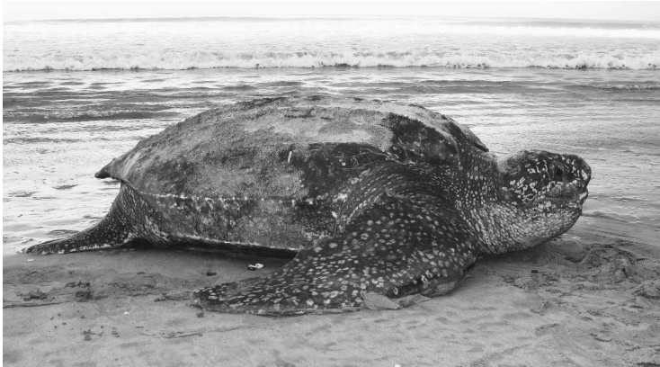
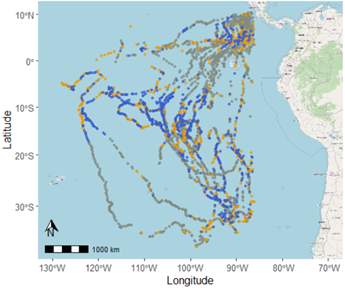
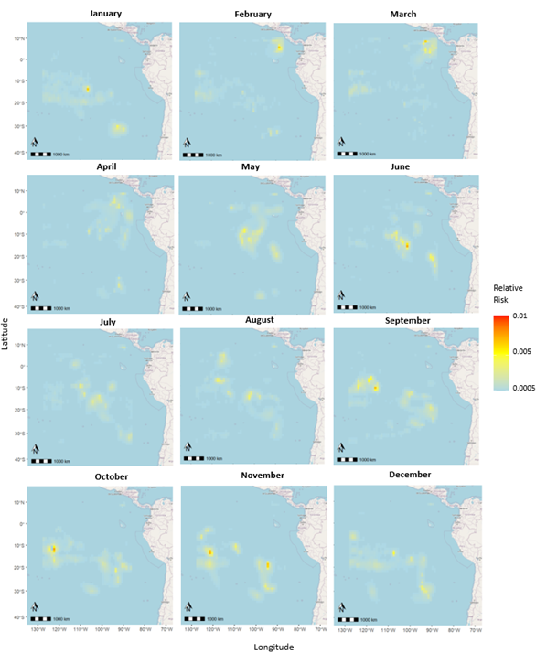
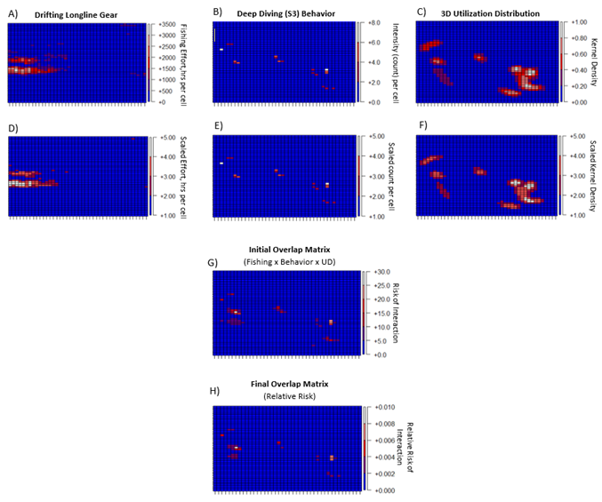
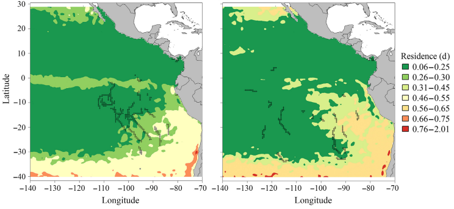
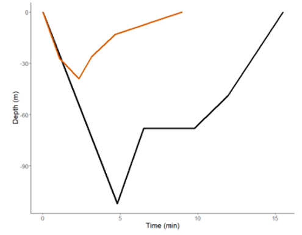
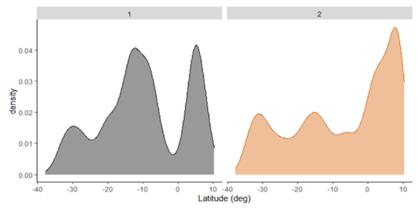

## This is a repository with example files for the Supplement of Barbour et al., 2023, *Incorporating multidimensional behavior into a dynamic management tool for a critically endangered and migratory species*. Available at: (https://conbio.onlinelibrary.wiley.com/doi/10.1111/cobi.14114).
 

 
**Leatherback photo by Dr. George Shillinger and sourced from Bailey et al. 2012.**

 

#### The goal of this repository is to provide example files and code to replicate similar results to Barbour et al. All questions should be directed to Nicole Barbour at *barbour@esf.edu* and acknowledgements should include citations to the main paper and the code authors (Nicole Barbour for most files, Nicole Barbour and Dr. Elie Gurarie for Stan code files). The example data has been "jittered" from 3 real turtle tracks, with the original, raw data owned by Upwell (https://www.upwell.org/) and originally published in Shillinger et al. (2008, 2010, 2011). Although users are welcome to adopt code to their purposes, no modifications may be made to original code, data, or this Github repository.
  

 
*Map of telemetry positions for N=28 leatherbacks, with points representing daily interpolated positions annotated by their predicted behavior state (grey-transiting, blue-deep diving/faster, yellow-shallower diving/slower). Results from Barbour et al. and original data from Shillinger et al. (2008).*

 

#### The analysis presented in these examples demonstrates how multidimensional behaviors identified with a movement model (Hidden Markov Model) can be integrated with 3D Utilization Distributions and threat data (specific fishing gears) to produce a monthly, Dynamic Management (DM) product of the relative risk of interaction of a target species with its main threat. As example, we demonstrate this process for the Eastern Pacific leatherback turtle (*Dermochelys coriacea*) population, which is critically endangered due to interactions with fishing vessels at sea and particularly with drifting longline fishing gears at depth. This analysis provides a novel addition to the existing DM tool for this population, South Pacific Turtle Watch (https://www.upwell.org/sptw).
 

 
*Example of the product that can be produced with the methods presented here (Barbour et al.). Monthly maps show the relative risk of interaction for leatherbacks performing deep-diving/high persistence behaviors with longline fishing gears.*

 

 
*Illustration of the methods shown in the example code files of this repository. Original matrices (derived in Steps 1-5) are shown for one example month (November) and for: A) gear-specific fishing effort (drifting longline gear); B) intensity of a particular behavioral state (state S3 or deep diving/high persistence behavior); and, C) normalized 3D utilization distributions. D-F) Each matrix is scaled to obtain values ranging from 1-5 on a 1̊ resolution grid of the study area. G) Matrices are then combined using elementwise multiplication to create an initial matrix of overlap. H) A final matrix, representing the relative risk of interaction for turtles in a particular behavioral state with a particular fishing gear for a particular month, is found by dividing the values of the initial overlap matrix (G) by the sum of its values.*

 

### Description of Files:

### This repository has folders for: example code ("Example_CodeFiles"), example data ("Example_Data"), and example Stan code ("Stan_CodeFiles"). For descriptions of methods in general, please see Barbour et al. Otherwise, code files have comments throughout and assume that users have intermediate R coding experience. Be sure that you have the most recent version of R, RStudio, and RTools! The Hidden Markov Models use a coding language and interface called Stan- for more information, see Barbour et al. and https://mc-stan.org/. Threat data comes from Global Fishing Watch (https://globalfishingwatch.org/) and is open-source to download. Code files include:

 

  
 
  * **Step1_HMM_ModelFit_Selection.R**: Code to fit Hidden Markov Models (HMM) with different structures, using the "rstan" interface for Stan. Models are fit individually and code further demonstrates how to select "best" models. 
  * **Step2_HMM_Diagnostics.R**: Code to perform diagnostics and visuals on the chosen models from Step 1. Example uses a 3-state HMM with chosen variables for dive type and move persistence velocity.
  * **Step3_3D_UD.R**: Code to determine 3D (x,y coordinates and time) Utilization Distribution surfaces on a population level and for each month of tracking data. 
  * **Step4_ThreatData_GFW.R**: Code to extract Global Fishing Watch (GFW) threat data and process so that there are monthly raster surfaces for each fishing gear type. Note: you don't need to run the first part of this code (lines 32-95)  yourself unless you want to download different raw data from the GFW website. Code uses one specific geartype (drifting longlines) as example.
  * **Step5_MatrixCreation_Multiplication.R**: Code to create convert raster or spatial objects from previous steps (HMM predictions, UD surfaces, GFW rasters) into matrices. Code then illustrates how to perform elementwise multiplication of matrices, so that for each unique combination of 1) month of your time series (tracking data) 2) HMM behavior state and 3) fishing geartype, you get a surface of the relative amount of interaction between them. Code uses one HMM behavior state (State 3) and one fishing geartype (drifting longlines) as example.
  * **Step6_FinalMap_QuantitativeIndices.R**: Code to create "nice" monthly maps for the surfaces of the "relative risk of interaction" created in Step 5, e.g. the combination of a particular HMM movement state with a particular threat (fishing geartype) in any one particular month. Code also shows how to create a data table with monthly quantitative indices for the highest relative risk of interaction between turtles and threats.
  
  

 

### Further Background:

 

#### These turtles are amazing, long distance, deep diving migrators! Despite the multidimensionality of their movements, previous movement models applied to tracking data for this population have had difficulty parsing out foraging behavior, potentially due to not incorporating vertical movements (Bailey et al. 2008, Bailey et al. 2012). The results of these previous studies suggest that Eastern Pacific leatherbacks may not only have multiple hidden states of movement that can be described with a mixture of horizontal and vertical movement variables, but that they may also have multiple foraging behaviors. This supports the need for a multi-state movement model that can use a combination of vertical and horizontal movement data to describe hidden behaviors of movement. These results are needed to produce new products than can inform current conservation tools for this critically endangered population, such as [South Pacific Turtle Watch](https://www.upwell.org/sptw). For further reading on the analyses that have been done for this population, please see [Bailey et al. 2008](https://www.researchgate.net/publication/222537046_Identifying_and_comparing_phases_of_movement_by_leatherback_turtles_using_state-space_models), [Shillinger et al. 2010](https://www.int-res.com/abstracts/esr/v10/p215-232/), [Shillinger et al. 2011](https://www.int-res.com/abstracts/meps/v422/p275-289/),  Bailey et al. [2012a](https://journals.plos.org/plosone/article?id=10.1371/journal.pone.0036401) and [2012b](https://esajournals.onlinelibrary.wiley.com/doi/full/10.1890/11-0633), [Schick et al. 2013](https://link.springer.com/article/10.1186/2051-3933-1-11), [Hoover et al. 2019](https://esajournals.onlinelibrary.wiley.com/doi/full/10.1002/ecs2.2644), and [Degenford et al. 2021](https://conbio.onlinelibrary.wiley.com/doi/full/10.1111/csp2.349).
 

 

*Example of the current Dynamic Management (DM) tool for Eastern Pacific leatherbacks (see Hoover et al. 2019). These monthly residence time maps (example, a) June and b) December) are updated monthly as part of Upwell's South Pacific Turtle Watch tool (https://www.upwell.org/sptw).*
 

#### This work additionlly builds on the results of Barbour et al., *Using machine learning approaches to classify vertical movement profiles and behavior*, where the dive profiles for this population (migratory, Eastern Pacific leatherback turtles) were classified with a Dynamic Time Warp clustering analysis into two ecologically significant groups. The two dive cluster groups differed in both their spatio-temporal distribution and their relationship with environmental covariates, with "D1" dives being deeper and longer compared to "D2" dives. Although both dive types are likely used for foraging behavior, "D2" dives were found to be dominant through the dispersive "corridor" turtles took from their nesting beaches into their foraging grounds within the oligotrophic, South Pacific ocean gyre. The daily counts or proportions of each of these dive types was used in this analysis as a vertical movement variable in the HMM's.
 

 
*Centroids (best representative shape) for two different dives types found with a clustering analysis (see Barbour et al). D1 (black) dives were found to be deeper and slightly longer in duration than D2 (orange) dives.*

 

 
*Density histograms for the spatial distribution of two dives types identified with a clustering analysis (see Barbour et al). D1 (black) dives were found to be most prominent in areas of the South Pacific ocean gyre where the nutricline is shallower but still at depth, potentially requiring deeper dives to locate dispersed prey. D2 (orange) dives were found to be prominent along equatorial latitudes, where transiting behavior has been identified.*

 

